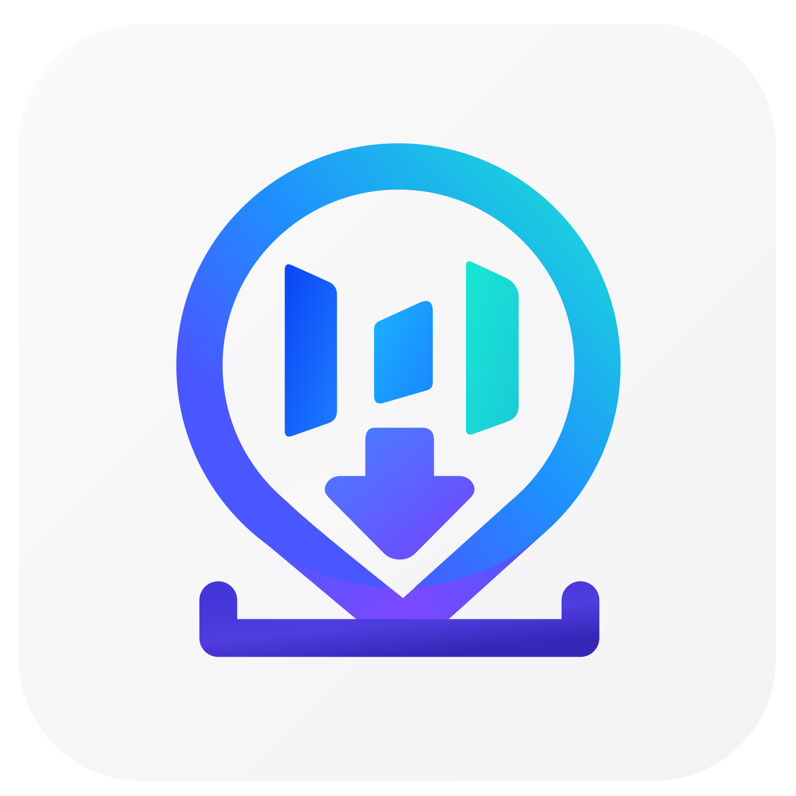

<div align="center">



# 无印字节

全平台无水印图片与视频下载器

一键解析豆包对话 · 千问对话 · 抖音视频/图文 · TikTok 视频/图文

</div>

---

## 功能一览

### 多源解析

| 平台 | 支持内容 | 登录方式 |
|------|---------|---------|
| **豆包** | 对话中的图片 + AI 生成视频 | 无需登录 |
| **千问** | 对话中的图片 | 无需登录 |
| **抖音** | 视频 · 图文 · 封面 · 音乐 | 扫码 / 网页 / Cookie |
| **TikTok** | 视频 · 图文 · 封面 · 音乐 | 网页 / Cookie |

### 核心特性

- **零服务端依赖** — 所有解析算法 (a_bogus / X-Bogus / API 路由) 完全打包在 App 内，无需自建服务器
- **无水印** — 抖音视频走 `play` 而非 `playwm`，图片/视频直取原始分辨率
- **批量下载** — 全选 / 单选，并行下载，实时进度追踪
- **视频内预览** — 播放/暂停、长按 2x 快进、进度条拖拽
- **封面 + 音乐** — 视频详情页右下角 SpeedDial 一键下载封面和背景音乐
- **扫码登录** — 抖音二维码协议完整实现（生成 → 轮询 → Cookie 写入），遇风控自动降级网页登录
- **解析历史** — 按日期分组、日期范围筛选、批量删除、缩略图回看、一键重解析
- **深色模式** — 豆包蓝 / 抖音黑双主题，跟随系统或手动切换
- **触感反馈** — 解析/选中/模式切换分级震动 (light/medium/heavy)
- **自动解析** — 粘贴链接后自动触发解析，无需手动点击

## 平台支持

| 平台 | 保存图片 | 保存视频 | 保存音乐 | 登录 WebView | 视频预览 |
|------|---------|---------|---------|-------------|---------|
| Android | Gal → 相册 | Gal → 相册 | Share Sheet | InAppWebView | video_player |
| iOS | Gal → 相册 | Gal → 相册 | Share Sheet | InAppWebView | video_player |
| macOS | Gal → 相册 | Gal → 相册 | SaveAs 对话框 | InAppWebView | video_player |
| Windows | Gal → 相册 | Gal → 相册 | SaveAs 对话框 | InAppWebView | 系统播放器 |
| Linux | Gal → 相册 | Gal → 相册 | SaveAs 对话框 | InAppWebView | xdg-open |
| HarmonyOS | 平台通道 → 相册 | 平台通道 → 相册 | 平台通道 → 分享 | InAppWebView | 平台通道 |

## 技术架构

```
lib/
├── main.dart                     # 三 Tab 框架 (首页 / 最近 / 设置) + 详情页 + 视频预览
├── pages/
│   ├── login_page.dart           # 抖音扫码登录 / TikTok 网页登录 / Cookie 手动输入
│   ├── open_source_page.dart     # 开源声明 & 条款 (Markdown 渲染)
│   └── repo_list_page.dart       # 使用的开源仓库列表
├── providers/
│   └── media_providers.dart      # Riverpod 状态层：Parse + Download + Settings + History
├── services/
│   ├── doubao_parser.dart        # 豆包/千问 API 解析 (alice + samantha 双端点)
│   ├── douyin_tiktok_parser.dart # 抖音/TikTok 视频与图文解析 (a_bogus / X-Bogus 签名)
│   ├── douyin_qr_login_client.dart # 抖音二维码登录协议 (Challenge → Poll → Cookie)
│   ├── abogus.dart               # 抖音 a_bogus 签名算法 (SM3/MD5/SHA256)
│   ├── xbogus.dart               # TikTok X-Bogus 签名算法
│   ├── inappwebview_login_service.dart # InAppWebView 登录桥接 (Android/iOS/macOS/Windows)
│   ├── webview_login_service.dart      # WebView 登录服务抽象层
│   ├── platform_services.dart    # 鸿蒙平台通道 + 触感反馈
│   └── app_preferences.dart      # SharedPreferences 持久化封装
├── theme/
│   └── app_theme.dart            # 豆包蓝 / 抖音黑 双主题定义
└── widgets/
    ├── login_guide_dialog.dart   # 首次切换抖音模式时的登录引导弹窗
    ├── privacy_notice_dialog.dart # 隐私提示弹窗
    └── markdown_viewer.dart      # Markdown 内容渲染器
```

## 解析流程

### 豆包

```
用户粘贴豆包对话链接 → 提取 share_id → POST /alice/message/share/get
                                         ↓ 失败
                                    POST /samantha/thread/share/snapshot/get
                                         ↓
                              遍历 message_list → content_block → creation_block → image/video
                                                    ↓ content_type=2022
                                              creation_full_content → task_info → asset
```

### 千问

```
用户粘贴千问对话链接 → 提取 share_id → POST chat2-api.qianwen.com/api/v1/share/info
                                         ↓
                              session.record_list → response_messages → multi_load → image
```

### 抖音

```
用户粘贴抖音链接 → 提取 aweme_id (正则 / 短链重定向)
                    ↓
              GET /aweme/v1/web/aweme/detail/ + a_bogus 签名 + Cookie
                    ↓
        aweme_detail → video.play_addr (playwm→play 去水印)
                    → images (图文)
                    → music.play_url (背景音乐)
```

### TikTok

```
用户粘贴 TikTok 链接 → 提取 itemId (正则 / 短链重定向)
                        ↓
              GET /api/item/detail/ + X-Bogus 签名 + Cookie
                        ↓
        aweme_detail → video.play_addr / bit_rate
                    → image_post_info.images (图文)
                    → music.play_url (背景音乐)
```

## 下载流程

| 类型 | 移动端 (Android/iOS) | 桌面端 (Win/Mac/Linux) | 鸿蒙 (OHOS) |
|------|---------------------|----------------------|------------|
| 图片 | Dio → bytes → Gal.putImageBytes → 相册 | 同左 | Dio → 临时文件 → saveMediaBatch → 相册 |
| 视频 | Dio.download → 临时文件 → Gal.putVideo → 相册 | 同左 | Dio → 临时文件 → saveMediaBatch → 相册 |
| 封面 | 复用图片流程 | 同左 | 同左 |
| 音乐 | Dio.download → Share.shareXFiles | Dio.download → FilePicker.saveFile | Dio.download → saveAudio → 系统分享 |

视频下载请求自动附加 `referer` 头 (按域名路由：douyin CDN → `douyin.com`，tiktok CDN → `tiktok.com`，其余 → `doubao.com`)，视频文件名强制带 `.mp4` 扩展名。

## 登录

### 抖音

1. **二维码登录** (移动端首选) — 完整实现 DouyinQrLoginClient：
   - `createChallenge()` → ttwid 匿名会话 → 请求二维码 (legacy/modern 双端点)
   - `poll()` → 2 秒轮询 → 等待/已扫码/确认/过期 状态机
   - 遇风控 (verify_ticket/captcha/risk_control) 自动降级 WebView 登录
   - 二维码支持保存到相册，供抖音扫一扫从相册识别
2. **WebView 登录** — InAppWebView 嵌入 sso.douyin.com，Cookie 自动提取
3. **Cookie 手动输入** — 桌面端打开浏览器后从 DevTools 复制粘贴

### TikTok

- **WebView 登录** — InAppWebView 嵌入 tiktok.com/login，Cookie 自动提取
- **Cookie 手动输入** — 备选方案

Cookie 写入后自动提取 `msToken` / `ttwid` / `sessionid` / `s_v_web_id` 等关键字段单独持久化，供解析稳定使用。

## 签名算法

| 算法 | 适用 | 实现 |
|------|------|------|
| **a_bogus** | 抖音 Web API | abogus.dart — 完整移植，SM3 哈希 + 参数编码 + 轮转混淆 |
| **X-Bogus** | TikTok Web API | xbogus.dart — 完整移植，SHA256 + UA 关联 + 定长输出 |

两个算法均基于 [Douyin_TikTok_Download_API](https://github.com/Evil0ctal/Douyin_TikTok_Download_API) (Apache-2.0) 的 Python 实现移植为纯 Dart，使用 `pointycastle` 库完成 SM3/MD5/SHA256 哈希运算。

## 界面

### 三 Tab 架构

- **首页** — 模式切换 (豆包/抖音 滑块动画) + 链接输入 + 粘贴按钮 + 解析按钮 + 结果预览条
- **最近** — 解析历史列表 (今天/昨天/更早)，支持日期筛选、批量管理、左滑删除
- **设置** — 默认模式、自动解析、黑夜模式、登录状态、开源项目、条款、缓存管理

### 详情页

- 内容检测结果卡 (N 张图片 / M 个视频)
- 全选图片 / 全选视频 开关
- 图片 2 列网格 + 视频 1 列列表，每项可勾选
- 图片尺寸标签 (4K/2K/1080p/720p/SD)
- 视频封面 + 时长 + 分辨率
- 底部操作栏：已选 N 项 + 下载所选按钮

### 视频预览

- 全屏播放，点击暂停/继续，长按 2x 快进
- 进度条拖拽，时间显示
- 右下角 SpeedDial FAB：下载封面 / 下载音乐

## 快速开始

### 环境要求

- Flutter >= 3.22.0 (Dart >= 3.4.0)
- Android SDK (compileSdk 35)
- Xcode 15+ (iOS/macOS)
- Visual Studio 2022+ (Windows)
- DevEco Studio 5+ (HarmonyOS)

### 安装依赖

```bash
flutter pub get
```

> **注意**: `flutter_inappwebview_android 1.1.3` 存在 AGP 9 兼容性问题，`pubspec.yaml` 已通过 `dependency_overrides` 指向官方 master 分支修复。若 `pub get` 后仍报 proguard 错误，需手动将 `proguard-android.txt` 替换为 `proguard-android-optimize.txt`。

### 运行

```bash
# 开发运行
flutter run

# Android Release APK
flutter build apk --release

# iOS
flutter build ios --release

# macOS
flutter build macos --release

# Windows
flutter build windows --release
```

### HarmonyOS 构建

1. 用 DevEco Studio 打开 `ohos/` 目录
2. 配置签名证书
3. 构建 HAP/APP

## 项目结构

```
doubao_app/
├── lib/                    # Dart 源码
├── android/                # Android 原生 (Kotlin, AGP 9, build.gradle.kts)
├── ios/                    # iOS 原生 (Swift, Runner.xcodeproj)
├── macos/                  # macOS 原生 (Swift)
├── windows/                # Windows 原生 (C++)
├── linux/                  # Linux 原生 (C++)
├── ohos/                   # HarmonyOS 原生 (ArkTS, EntryAbility + NomarkPlatformPlugin)
├── logo/                   # SVG/PNG 图标资源
├── tool/                   # 开发辅助脚本 (URL 测试 / 解析验证 / 视频下载测试)
├── test/                   # 单元测试
├── LICENSE                 # GPLv3
├── PRIVACY_POLICY.md       # 隐私政策
├── TERMS_OF_USE.md         # 使用条款
├── THIRD_PARTY_LICENSES.md # 第三方许可证
└── pubspec.yaml            # 依赖声明
```

## 依赖

| 包 | 用途 |
|----|------|
| `dio` + `cookie_jar` + `dio_cookie_manager` | HTTP 请求 + Cookie 管理 |
| `flutter_riverpod` | 状态管理 (手写 StateNotifier) |
| `gal` | 图片/视频保存到系统相册 |
| `shared_preferences` | 本地持久化 (设置 + 解析历史) |
| `path_provider` | 平台缓存目录 |
| `flutter_svg` | SVG 图标渲染 |
| `pointycastle` | SM3/MD5/SHA256 哈希 (a_bogus / X-Bogus) |
| `video_player` | 视频预览播放 |
| `flutter_markdown` | Markdown 渲染 (条款页面) |
| `url_launcher` | 打开外部链接 |
| `flutter_inappwebview` | 内置浏览器 (登录) |
| `share_plus` | 音乐文件分享 (移动端) |
| `file_picker` | SaveAs 对话框 (桌面端音乐保存) |

## 隐私与安全

- **无自建服务器** — 所有网络请求直连目标平台 API，App 不收集、不转发任何用户数据
- **Cookie 本地存储** — 登录凭据仅保存在设备 SharedPreferences，不上传、不共享
- **二维码安全校验** — DouyinQrLoginClient 仅信任 `*.douyin.com` / `*.bytedance.com` / `*.byteimg.com` 等域名，拒绝不可信跳转
- **响应大小限制** — JSON 响应 64 KB 上限，二维码图片 512 KB 上限，防止内存溢出
- **Cookie 值校验** — 仅接受符合 RFC 6265 安全字符集的 Cookie 值

## 致谢

- [Douyin_TikTok_Download_API](https://github.com/Evil0ctal/Douyin_TikTok_Download_API) — a_bogus / X-Bogus 签名算法参考 (Apache-2.0)
- [doubao-nomark](https://github.com/ihmily/doubao-nomark) — 豆包解析 API 参考
- [Flutter](https://flutter.dev) — 跨平台 UI 框架

## 许可证

[GNU General Public License v3.0](LICENSE)

---

<div align="center">

**无印字节** — 粘贴链接，提取无水印素材，就这么简单。

</div>
